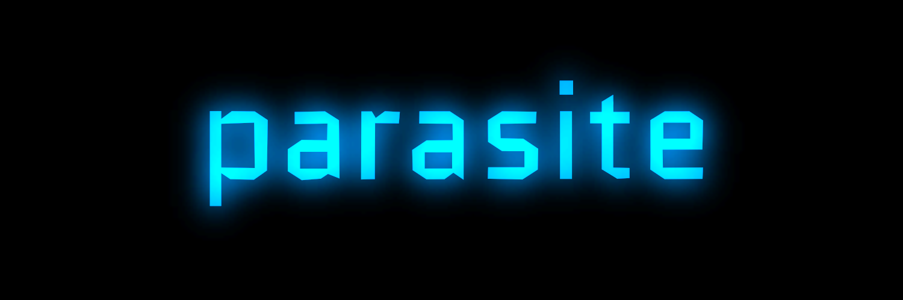

<div align="center">

<h1 align="center">Parasitic-AI-Platform</h1>
<h3 align="center">Framework for Cloning and Managing Parasitic AI Agents</h3>

[](https://opensource.org/licenses/MIT)
[](https://www.rust-lang.org/)
[](https://github.com/LouisEllington/ParasiteAi/actions)
[](https://github.com/LouisEllington/ParasiteAi)
[](https://github.com/LouisEllington/ParasiteAi/issues)
[](https://github.com/LouisEllington/ParasiteAi)
</div>

# Advanced Parasitic AI Platform

## Overview

This project showcases the integration of the Arc architecture, built with Rust, to create an innovative **Parasitic AI Platform**. Our goal is to enable cloning and analysis of AI agents while providing a secure, scalable, and developer-friendly system.

### Key Features
- **Parasitic AI Agent Cloning**: Replicate existing AI agents for experimentation and research.
- **Multi-Network Support**: Analyze and manage agents across diverse ecosystems, including blockchain networks.
- **Interactive Agent Interface**: A CLI and API system for seamless interaction with the platform.
- **Modular Design**: Built with modularity in mind, ensuring scalability and extensibility.

## Technical Stack
- **Programming Language**: Rust
- **Framework**: Arc Architecture for reactive and concurrent processing.
- **Data Communication**: GraphQL APIs with Zapper Integration.
- **Enhancements**: Integrations for OpenAI GPT models for intelligent feedback.

---

## Getting Started

### Prerequisites
Ensure you have the following installed:
- **Rust and Cargo**
- **Environment Variables**:
  - OpenAI API Key: `OPENAI_API_KEY`
  - Zapper API Key: `ZAPPER_API_KEY`

### Setup
1. Clone the repository:
    ```bash
    git clone https://github.com/LouisEllington/ParasiteAi
    cd ai-parasitic-platform
    ```
2. Create a `.env` file and add API keys:
    ```env
    OPENAI_API_KEY=your_openai_key
    ZAPPER_API_KEY=your_zapper_key
    ```
3. Build and run the project:
    ```bash
    cargo build
    cargo run
    ```

---

## How It Works

### Parasitic Agent Workflow
1. **Input Agent**: Provide the details of the target AI agent to clone.
2. **Cloning Process**:
    - Extract key behaviors and capabilities.
    - Use Arc-based components for modular replication.
3. **Analysis & Deployment**:
    - Analyze cloned agent outputs across different networks.
    - Deploy agents for further interaction and experimentation.

### Modular Components

- **`src/main.rs`**: Entry point of the application.
- **`src/zapper/`**: Handles communication with Zapper GraphQL APIs.
- **`src/tools/portfolio.rs`**: Defines tools for AI portfolio analysis.
- **`src/types.rs`**: Contains shared types and structures for modularity.

---

## Example Usage

### CLI Example
```bash
> analyze <wallet-address>

Example:
> analyze your.solana.address  # For Solana addresses
```

---

## Development Roadmap

1. **Prototype Phase**
    - Basic agent cloning functionality.
    - Initial testing with blockchain integrations.
2. **Feature Expansion**
    - Support for advanced AI toolchains.
    - Enhancements for UX/UI.
3. **Security Upgrades**
    - Multi-factor authentication (MFA).
    - Encrypted data handling.
4. **Market Deployment**
    - Partnerships with AI and blockchain ecosystems.
    - Scalability for large-scale agent management.
5. **Continuous Improvement**
    - Feedback-driven updates.
    - State-of-the-art AI and Rust integrations.

---

## Contributing

We welcome contributions from the community. To contribute:

1. Fork the repository and clone it locally.
2. Create a new branch for your feature or fix.
3. Submit a pull request for review.

---

## License

This project is licensed under the MIT License. See `LICENSE` for details.